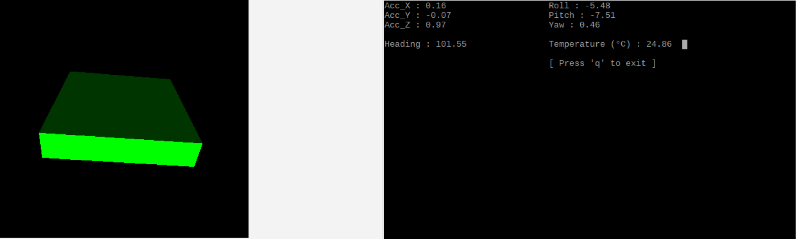

# IMU GY-85
## acc : adxl345
## gyro : itg3200
## magneto : qmc5883L

Raspberry IMU datas visualiser



requirements :
python3
vpython(optional)

installation :
```
sudo apt-get update
sudo apt-get install build-essential python-pip python-dev python-smbus
cd Adafruit_Python_GPIO
sudo python3 setup.py install
```

usage : 
```
python3 main.py [--v](vpython needed)
```

